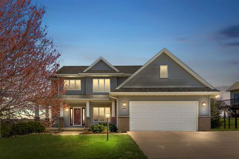
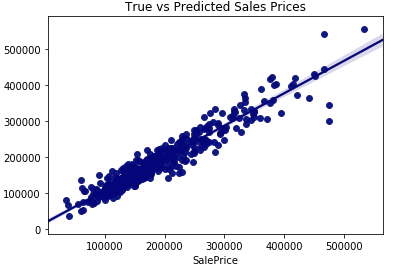
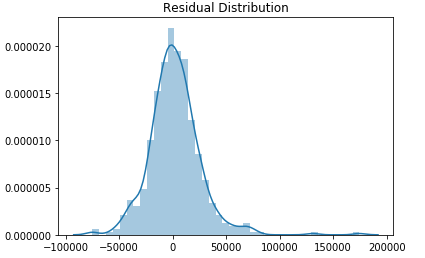

# Ames Housing Regression
### Authored by : Sean Bjork

###### 

## Problem Statement
- Can house prices be modeled within an average error (RSME) of $25,000?
- To solve this problem, we analyze a data set containing both objective and subjective house features, such as total square footage and overall quality.

## Data
- 2051 rows (houses) and 81 columns (features and target SalePrice), collected from Ames, Iowa Assessor’s Office
 - Final data frame (before preprocessing) 2050 rows and 25 columns (relevant features and target)
 

## Repository Structure
- Repository Location:
  - (./code/Ames_Housing_Project_Notebook.ipynb)
- Data Location:
  - (./datasets/final.csv)
- Presentation Location:
  - (./slides/ames_presentation.pdf)

## Executive Summary
After fully cleaning our data set and selecting the variables with significant effect on sale price, we employed a process of feature engineering. The primary features we desired to engineer include projected prices relative to average sale prices for each category within a few categorical variables: neighborhood, overall quality, and total rooms (above ground). The projected prices were found using the standard deviations within an interaction column, created by multiplying several, logged features together. Next, we implemented Polynomial Features upon our dataframe with engineered variables and applied the natural logarithm to our target variable, SalePrice. The reasoning behind this latter step is to achieve greater normality of targets, ultimately giving our model better predictions. We then conducted a Train/Test Split, followed by a Standard Scaler. When standardizing, we fitted and transformed the training data, while we only transformed the testing data. From here, we tried our model options: Linear Regresson, Lasso, and Ridge. Of these, Ridge was deemed the best fitting model based on the desired metric to optimize, Root Mean Square Error. The scatter plot of true target values for the testing data against the target values predicted by our model is provided below. Also shown is the distribution of the residuals (all true targets minus all predicted targets).

## Findings/Conclusions
From our study, we conclude that is, indeed, possible to predict housing prices within an average error of $25,000 - our RSME was found to be $24,145 with our Ridge regression. This is possible with detailed information about the houses, such as square footage, number of rooms, and subjective measures such as overall quality and external quality. However, as seen in scatterplot above, our model performs worse with high-valued homes; although our average (root mean) error is under our desired threshold, the maximum error is relatively high - we predicted incorrectly by almost $175,000 for one home. Despite the poor fit our model gives to outlier/high-value homes, it performs well with almost 90% of the data (R Squared: .89).

## Recommendations/Future Steps
- Based on our study, it was deemed possible to predict house prices within an average error of $25,000. This error is acceptable, considering the negotiation margin for each house sale.
- However, due to the high maximum residual value for our model, less than 100% of houses can be expected to be close to our mean squared error.
- In the future, the feature engineering will be conducted differently. Due to the fact that our "projected" feauture incorporated the sale price column, our model seems to be unable to predict data sets without target, at least in it's current form. Several hours were spent to correct this problem to no avail.

## References
- Data Description: http://jse.amstat.org/v19n3/decock/DataDocumentation.txt
- House image: https://ap.rdcpix.com/2083533362/eab10a8a3be4b5065bfd3a87e0e11becl-m0xd-w480_h480_q80.jpg
